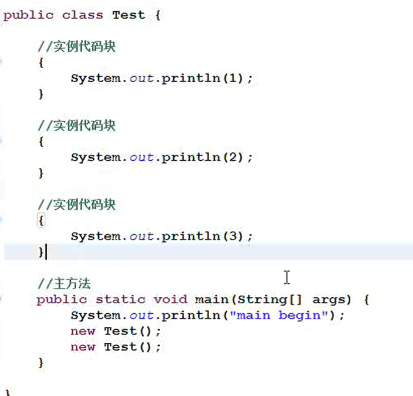
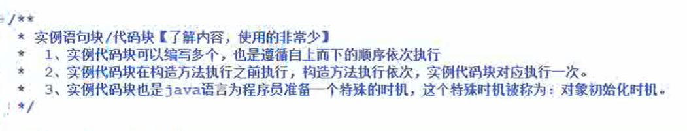
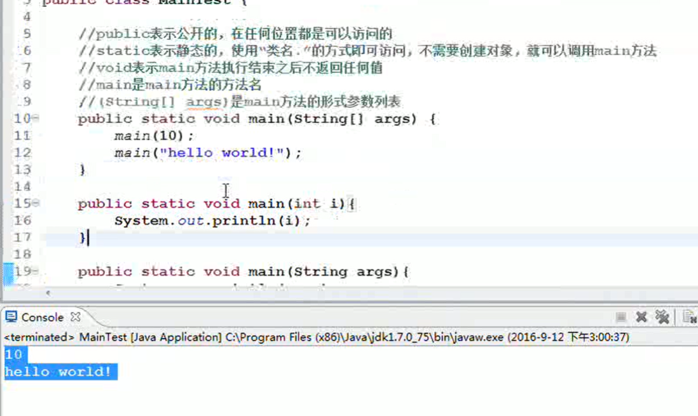

#  1.this关键字

static中不能使用this

同一类 中的实例方法，可以相互的调用，因为调用实例方法使用 引用.实例方法，当创建这个类的实例的时候已经具有了this指向了自己所以在实例方法中可以相互的调用。

**在static方法中不能直接访问实例变量和实例方法*，因为实例变量和实例方法都需要对象的存在而static方法当中是没有this的，也就是说当前对象是不存在的，也就不能访问**

# 2.static

带有static是类级别的。静态变量，静态变量在类加载的时候初始化，不需要创建对象，内存就开辟了。

**静态变量存放在方法区当中**

所有静态的数据类名. 也可以采用引用. 但是建议采用类名.的方式访问。

采用引用. 的方式访问的时候，即使引用是Null,也不会出现空指针异常。因为访问静态的数据不需要对象的存在。

总结：

 ## 3.static静态代码块

1. static{

java语句

​        }

2. 静态代码块在类加载时执行，并且只执行一次

3. 静态代码块在一个类中可以编写多个，并且尊新自上而下的顺序一次执行

4. 

5. 

   

## 4.实例代码块

输出123123

static方法也可以重载，**main方法也可以重载**

