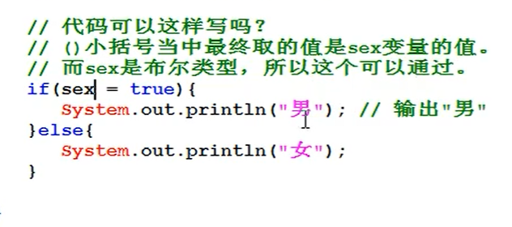
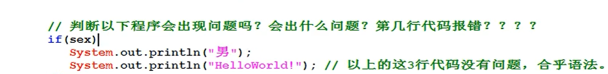
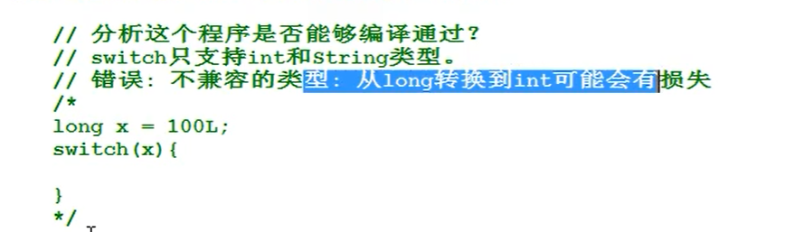
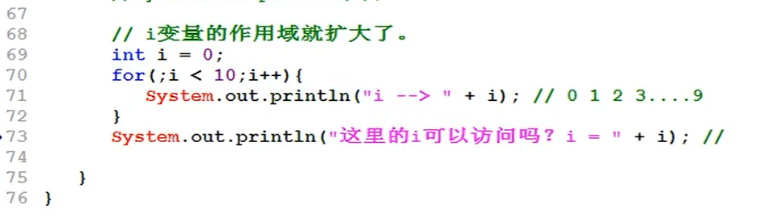

# 1.if

if() {}    if ''（）''括号中的必须是boolean类型


带有else的一定可以保证一个分支可以执行



if语句如果只有一个分支的话，可以省略大括号



# 2.switch语句

   1. swith语句也叫选择语句

   2. 语法格式

      ```java
      switch(值){
      
      case 值1：这个地方可以跟上多个case eg. case1 case2 .....
      
      			java语句；
      
      			break;
      
      case 值2：
      
      			java语句；
      
      			break;
      
      case 值3：
      
      			java语句；
      
      			break;
      
      default:
      
      			java语句
      
      	}其中break语句不是必须的，default也不是必须的
      ```

      

      switch语句支持的值有哪些？？

      int类型和string类型，但一定要注意JDK的版本在jdk8之前不支持String类型

      byte,short,char也可以往switch()中放，但最后要转换为int，是自动类型转换的。

3. swith语句原理

   拿‘值’与‘值1’进行比较，如果相同，则执行该分支中的java语句，如果不相等会继续拿值与‘值2’进行比较，如果相同，则执行该分支中的java语句

   ***注意：如果分支执行了，但是如果没有break，会发生case穿透现象。***

   

4. 

# 3.循环语句

## 	1. for循环

for循环的语法机制及运行原理

语法机制：


​	for(初始化表达式；条件表达式；更新表达式){

​	循环体

}

**注意：**

​	**第一初始化表达式最先执行，并且在整个循环中只执行一次。**

​	**第二：条件表达式结果必须是一个布尔类型，也就是：true或false**

**执行原理：**

​	1首先是初始表达式执行

​	2判断条件表达式

​	3执行循环体

​	4更新表达式

```
	2.  for 的变体
```

 


 

## 2.while循环

​	while循环：

​			1.while循环的语法机制及执行原理

​					语法机制：

```java
while(布尔表达式){
    循环体；
}
执行原理：
    布尔表达式的结果，如果为真，就执行循环体，
    循环体结束后，再次判断布尔表达式的结果
    
```


## 3.do-while循环

​	do..while循环语句执行原理及机制

​		语法：

```java
do{
    循环体
}while();//注意分号
```

***do_while先去执行循环体一次，然后判断条件*,do_while 至少执行一次**

## 4. 转向语句

* break
* continue
* return 

break语句用在两个地方：

 1. switch语句当中，用来终止switch的执行，防止case穿透现象

 2. 用在循环语句当中，用来终止循环的执行

    for，while，do_while